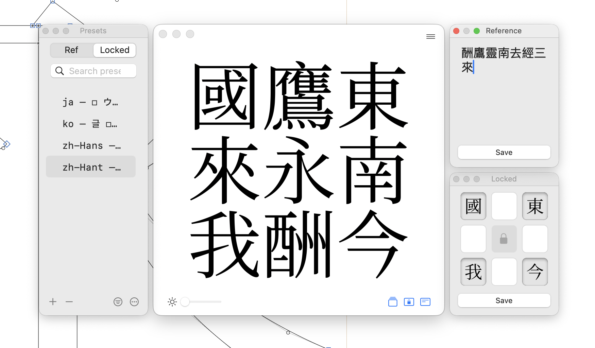

[English](#nineboxview-pro) | [繁體中文](#九宮格預覽-pro)

---

# NineBoxView Pro

  
  
<strong>Nine-grid preview tool for Glyphs 3</strong>

  
  
  

  

## Features

- **Native Performance** — Built with Objective-C for smooth, lag-free interaction
- **Drag & Drop** — Intuitive glyph arrangement with visual feedback
- **Smart Locking** — Pin reference glyphs for precise spacing comparison
- **CJK Optimized** — Designed for Hanzi, Kana, and Hangul workflows

## Installation

### Plugin Manager (Recommended)

1. In Glyphs, open **Window > Plugin Manager**
2. Search for "NineBoxView Pro"
3. Click "Install"

### Manual Installation

1. Download `NineBoxViewPro.glyphsPlugin` from [Releases](https://github.com/yintzuyuan/NineBoxView-Pro/releases/latest)
2. Double-click the file to install
3. Restart Glyphs

## Quick Start

1. Select **View > NineBoxView Pro** to open the panel
2. Click the **Reference** button in the toolbar
3. Enter reference glyphs (e.g., `永東國酬`)
4. Click inside the grid to randomly arrange

## Requirements

- **Glyphs 3.2** or later
- **macOS 12.0** or later

## Documentation

- [Official Guide](https://erikyin.net/NineBoxView-Pro/) (EN / 繁中 / 简中 / 日本語 / 한국어)
- [Report Issues](https://github.com/yintzuyuan/NineBoxView-Pro/issues)

## License

Commercial license with **14-day free trial**. Full functionality during trial. Purchase option available within the plugin.

Looking for the free version? See [NineBoxView (Python)](https://github.com/yintzuyuan/NineBoxView) — the original open-source version.

## Links

- [Official Website](https://erikyin.net/NineBoxView-Pro/)
- [Legacy Python Version](https://github.com/yintzuyuan/NineBoxView)

---

# 九宮格預覽 Pro

  
  
<strong>Glyphs 3 九宮格預覽工具</strong>

  
  
  

  

## 功能特色

- **原生效能** — 使用 Objective-C 開發，流暢無延遲
- **拖放操作** — 直覺的字符排列，具視覺回饋
- **智慧鎖定** — 固定參考字進行精準間距比對
- **CJK 最佳化** — 專為漢字、假名、韓文工作流程設計

## 安裝方式

### 外掛程式管理員（推薦）

1. 在 Glyphs 中，開啟**視窗 > 外掛程式管理員**
2. 搜尋「NineBoxView Pro」
3. 點擊「安裝」

### 手動安裝

1. 從 [Releases](https://github.com/yintzuyuan/NineBoxView-Pro/releases/latest) 下載 `NineBoxViewPro.glyphsPlugin`
2. 雙擊檔案進行安裝
3. 重新啟動 Glyphs

## 快速開始

1. 選擇**顯示 > 九宮格預覽 Pro** 開啟面板
2. 點擊工具列的**參考字**按鈕
3. 輸入參考字（例如：`永東國酬`）
4. 點擊格子內部隨機排列

## 系統需求

- **Glyphs 3.2** 或更高版本
- **macOS 12.0** 或更高版本

## 文件

- [官方指南](https://erikyin.net/NineBoxView-Pro/)（EN / 繁中 / 简中 / 日本語 / 한국어）
- [問題回報](https://github.com/yintzuyuan/NineBoxView-Pro/issues)

## 授權

商業授權，提供 **14 天免費試用**。試用期間功能完整。購買選項在外掛內提供。

需要免費版本？請參考 [NineBoxView (Python)](https://github.com/yintzuyuan/NineBoxView) — 原始開源版本。

## 連結

- [官方網站](https://erikyin.net/NineBoxView-Pro/)
- [舊版 Python 版本](https://github.com/yintzuyuan/NineBoxView)

---

© 2025 TzuYuan Yin. All Rights Reserved.
