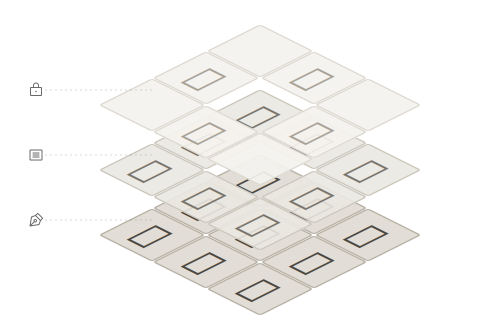

# {{NINE_BOX_VIEW}}

A 9-grid preview tool that allows type designers to preview the arrangement of a glyph alongside reference characters in real-time during the design process.

## Table of Contents

- [Installation](#installation)
- [Quick Start](#quick-start)
- [Core Concept: Three-Layer Preview System](#core-concept-three-layer-preview-system)
- [Interface Overview](#interface-overview)
- [Grid Position Definition](#grid-position-definition)
- [Features](#features)

## Installation

### Install via {{GLYPHS_PLUGIN_MANAGER}}

> [!TIP]
> We recommend installing via {{GLYPHS_PLUGIN_MANAGER}} for automatic updates.

1. In Glyphs, open **{{GLYPHS_WINDOW_MENU}} > {{GLYPHS_PLUGIN_MANAGER}}**
2. Search for "{{NINE_BOX_VIEW|}}"
3. Click "{{GLYPHS_INSTALL}}"

### Manual Installation

1. Download the plugin file (.glyphsPlugin)
2. Double-click the file to install
3. Restart Glyphs

## Quick Start

1. **Open the plugin**: Select **{{GLYPHS_VIEW_MENU}} > {{NINE_BOX_VIEW}}**
2. **Enter reference glyphs**: Click the {{ICON_REFERENCE}} button in the toolbar to open the {{REFERENCE_PANEL_TITLE|}}
3. **View the preview**: The grid displays the current editing glyph (center) with surrounding reference characters

### Get Started in 30 Seconds

```
1. Open the 9-grid window
2. Enter reference glyphs: 永東國酬
3. Click inside the grid area to randomly arrange the reference glyphs
4. Continue editing your glyph and preview the arrangement in real-time
```

> [!TIP]
> Hold **Shift** to enter Solo mode, temporarily hiding reference and locked glyphs.

## Core Concept: Three-Layer Preview System

{{NINE_BOX_VIEW}} uses a three-layer stacking design, allowing you to observe how a glyph performs in different contexts simultaneously:

<figure class="concept-figure">
  
</figure>

### {{ICON_PEN_NIB}} Editing Glyph (Bottom Layer)

The glyph currently being edited, synchronized in real-time across all cells of the grid. This is your work focus.

### {{ICON_ARTICLE}} Reference Glyphs (Middle Layer)

Randomly arranged common characters that help you quickly identify problematic pairings. Click inside the grid to reshuffle.

### {{ICON_LOCK}} Locked Glyphs (Top Layer)

Characters fixed at designated positions, establishing a stable comparison baseline. Settings are saved with the file.

> [!NOTE]
> The three layers are stacked from bottom to top. Locked glyphs take priority over reference glyphs and will cover the reference glyph at that position.

### Drag Relationships

Drag operations between the three layers have different restrictions:

| Layer | Can Receive Drag | Can Output Drag | Description |
|-------|-----------------|-----------------|-------------|
| {{ICON_PEN_NIB}} Editing Glyph | ✗ | ✓ | Center cell can only output, cannot be a drop target |
| {{ICON_ARTICLE}} Reference Glyphs | ✓ (visible layer) | ✓ | Can swap with visible top-layer glyphs |
| {{ICON_LOCK}} Locked Glyphs | ✓ | ✓ | Can be added from editing or reference layers via ⌘ + drag |

> [!TIP]
> To fix the current editing glyph at a specific position, use **⌘ + drag** from the center cell to the target position to create a locked glyph.

## Interface Overview

### Main Window

The 9-grid main window is a floating panel that contains:

- **Grid display area**: A 3×3 glyph preview grid
- **Toolbar**: Action buttons at the bottom
- **Title bar menu**: The **{{TITLEBAR_MENU_TOOLTIP|}}** button at the top right

### Toolbar Buttons

| Button | Function | Description |
|--------|----------|-------------|
| {{ICON_SUN}}/{{ICON_MOON}} | Theme toggle | Switch between light/dark mode |
| Slider | Blur intensity | Adjust blur level for the entire grid window to check overall gray distribution |
| {{ICON_PRESETS}} | {{PRESETS_WINDOW_TITLE|}} | Open/close the presets panel |
| {{ICON_LOCK}} | {{LOCKED_PANEL_TITLE|}} | Open/close the Locked Glyph Panel |
| {{ICON_REFERENCE}} | {{REFERENCE_PANEL_TITLE|}} | Open/close the reference input panel |
| {{ICON_MENU}} | {{TITLEBAR_MENU_TOOLTIP|}} | Open the info menu |

### Info Menu

Click the **{{ICON_MENU}}** button in the title bar to open:

| Item | Description |
|------|-------------|
| {{ABOUT_MENU_ITEM|}} | Open {{ABOUT_WINDOW_TITLE|}} |
| {{INFO_MENU_PURCHASE|}} | Purchase license (shown during trial) |
| {{INFO_MENU_ENTER_LICENSE|}} | Enter license key (shown during trial) |
| {{INFO_MENU_HELP|}} | Open user guide (this document) |
| {{INFO_MENU_WEBSITE|}} | Go to official website |
| {{INFO_MENU_FEEDBACK|}} | Submit feedback (GitHub Issues) |
| {{INFO_MENU_TESTIMONIAL|}} | Share your experience on social media |
| {{INFO_MENU_CONTACT_US|}} | Contact developer (email) |

> [!NOTE]
> During the trial period, the menu will show remaining days and purchase/license entry options.

### Context Menu

Right-click inside the grid area to open the context menu:

| Item | Description |
|------|-------------|
| {{CONTEXT_MENU_INSERT_AT_CURSOR|}} | Insert grid content at cursor position in Glyphs edit view |
| {{CONTEXT_MENU_OPEN_IN_NEW_TAB|}} | Open grid content in a new tab |
| {{CONTEXT_MENU_SHOW_TOOLBAR|}} / {{CONTEXT_MENU_HIDE_TOOLBAR|}} | Toggle toolbar visibility |
| {{CONTEXT_MENU_SHOW_REFERENCE_INPUT|}} / {{CONTEXT_MENU_HIDE_REFERENCE_INPUT|}} | Toggle {{REFERENCE_PANEL_TITLE|}} visibility |
| {{CONTEXT_MENU_SHOW_LOCKED_PANEL|}} / {{CONTEXT_MENU_HIDE_LOCKED_PANEL|}} | Toggle {{LOCKED_PANEL_TITLE|}} visibility |
| {{CONTEXT_MENU_SHOW_PRESETS|}} / {{CONTEXT_MENU_HIDE_PRESETS|}} | Toggle {{PRESETS_WINDOW_TITLE|}} visibility |
| {{CONTEXT_MENU_LIGHT_MODE|}} / {{CONTEXT_MENU_DARK_MODE|}} | Toggle theme mode |
| {{CONTEXT_MENU_SHOW_GRID_LINES|}} / {{CONTEXT_MENU_HIDE_GRID_LINES|}} | Toggle grid lines |

## Grid Position Definition

The grid positions are numbered as follows:

```
| 6 | 7 | 8 |  ← Top
| 3 | 4 | 5 |  ← Center
| 0 | 1 | 2 |  ← Bottom
```

- **Position 4**: Center cell, displays the current editing glyph, cannot be locked
- **Other positions**: Can hold reference or locked glyphs

## Features

### Preview Layer Features

#### [{{REFERENCE_PANEL_TITLE|}} Feature](guide-reference)

> Reference glyphs are the "middle layer" of the three-layer preview system, positioned above the editing glyph.

Enter a set of reference characters to display around the grid, helping you observe the visual effect of a glyph in different contexts.

**Use cases**:

- Observe glyph pairing with characters of different stroke densities
- Check character spacing and visual balance
- Simulate real typesetting scenarios

#### [{{PALETTE_TAB_LOCKED|}} Feature](guide-lock)

> Locked glyphs are the "top layer" of the three-layer preview system, taking priority over reference glyphs.

Fix a specific glyph at a designated position to establish a stable comparison baseline.

**Use cases**:

- Fix a standard character as a design reference
- Create glyph pairing comparisons
- Track design consistency

### Productivity Tools

#### [{{PRESETS_WINDOW_TITLE|}} Feature](guide-presets)

Save commonly used reference glyph combinations or locked configurations for quick switching between different testing scenarios.

**Use cases**:

- Save test glyph sets for different languages
- Save project-specific reference configurations
- Share settings across different font files

## More Information

- [{{REFERENCE_PANEL_TITLE|}} Feature Details](guide-reference)
- [{{PALETTE_TAB_LOCKED|}} Feature Details](guide-lock)
- [{{PRESETS_WINDOW_TITLE|}} Feature Details](guide-presets)
- [Advanced Features](guide-advanced)
- [License & Trial](guide-license)
- [FAQ](guide-faq)
