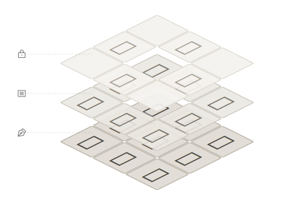

# {{NINE_BOX_VIEW}}

9マスプレビューツール。フォントデザイナーがデザイン作業中に、編集中の文字と周囲の参照文字の並びをリアルタイムで確認できます。

## 目次

- [インストール方法](#インストール方法)
- [クイックスタート](#クイックスタート)
- [コアコンセプト：3層プレビューシステム](#コアコンセプト3層プレビューシステム)
- [インターフェース概要](#インターフェース概要)
- [9マス位置の定義](#9マス位置の定義)
- [機能説明](#機能説明)

## インストール方法

### {{GLYPHS_PLUGIN_MANAGER}}からインストール

> [!TIP]
> {{GLYPHS_PLUGIN_MANAGER}}からのインストールをお勧めします。自動更新が利用できます。

1. Glyphsで **{{GLYPHS_WINDOW_MENU}} > {{GLYPHS_PLUGIN_MANAGER}}** を開く
2. 「{{NINE_BOX_VIEW|}}」を検索
3. 「{{GLYPHS_INSTALL}}」をクリック

### 手動インストール

1. プラグインファイル（.glyphsPlugin）をダウンロード
2. ファイルをダブルクリックしてインストール
3. Glyphsを再起動

## クイックスタート

1. **プラグインを開く**：**{{GLYPHS_VIEW_MENU}} > {{NINE_BOX_VIEW}}** を選択
2. **参照文字を入力**：ツールバーの {{ICON_REFERENCE}} ボタンをクリックして{{REFERENCE_PANEL_TITLE|}}を開く
3. **プレビューを確認**：9マスに現在編集中の文字（中央）と周囲の参照文字が表示される

### 30秒で始める

```
1. 9マスウィンドウを開く
2. 参照文字を入力：あアいイ
3. 9マス内をクリックすると、参照文字がランダムに配置される
4. 文字の編集を続けると、配置効果がリアルタイムでプレビューされる
```

> [!TIP]
> **Shift** キーを押し続けるとSoloモードになり、参照文字とロック文字が一時的に非表示になります。

## コアコンセプト：3層プレビューシステム

{{NINE_BOX_VIEW}} は3層スタック設計を採用しており、異なるコンテキストでの文字の表現を同時に観察できます：

<figure class="concept-figure">
  
</figure>

### {{ICON_PEN_NIB}} 編集文字（最下層）

現在編集中の文字で、9マスの各セルにリアルタイムで同期表示されます。これが作業の焦点です。

### {{ICON_ARTICLE}} 参照文字（中間層）

ランダムに配置された一般的な文字で、問題のある組み合わせを素早く発見するのに役立ちます。9マス内をクリックするとシャッフルされます。

### {{ICON_LOCK}} ロック文字（最上層）

指定位置に固定された文字で、安定した比較基準を確立します。設定はファイルと共に保存されます。

> [!NOTE]
> 3層は下から上に重ねて表示されます。ロック文字は参照文字より優先され、その位置の参照文字を上書きします。

## インターフェース概要

### メインウィンドウ

9マスメインウィンドウはフローティングパネルで、以下を含みます：

- **9マス表示エリア**：3×3の文字プレビューグリッド
- **ツールバー**：下部の操作ボタンエリア
- **タイトルバーメニュー**：右上の **{{TITLEBAR_MENU_TOOLTIP|}}** ボタン

### ツールバーボタン

| ボタン | 機能 | 説明 |
|-------|------|------|
| {{ICON_SUN}}/{{ICON_MOON}} | テーマ切替 | ライト/ダークモードを切り替え |
| スライダー | ぼかし度 | 9マスウィンドウ全体のぼかし度を調整し、全体のグレー分布を確認 |
| {{ICON_PRESETS}} | {{PRESETS_WINDOW_TITLE|}} | プリセットパネルを開く/閉じる |
| {{ICON_LOCK}} | {{LOCKED_PANEL_TITLE|}} | ロック文字パネルを開く/閉じる |
| {{ICON_REFERENCE}} | {{REFERENCE_PANEL_TITLE|}} | 参照文字入力パネルを開く/閉じる |
| {{ICON_MENU}} | {{TITLEBAR_MENU_TOOLTIP|}} | 情報メニューを開く |

### 情報メニュー

タイトルバーの **{{ICON_MENU}}** ボタンをクリックして開く：

| 項目 | 説明 |
|-----|------|
| {{ABOUT_MENU_ITEM|}} | {{ABOUT_WINDOW_TITLE|}}を開く |
| {{INFO_MENU_PURCHASE|}} | ライセンスを購入（試用期間中に表示） |
| {{INFO_MENU_ENTER_LICENSE|}} | ライセンスキーを入力（試用期間中に表示） |
| {{INFO_MENU_HELP|}} | ユーザーガイドを開く（このドキュメント） |
| {{INFO_MENU_WEBSITE|}} | 公式サイトに移動 |
| {{INFO_MENU_FEEDBACK|}} | フィードバックを送信（GitHub Issues） |
| {{INFO_MENU_CONTACT_US|}} | 開発者に連絡（メール） |

> [!NOTE]
> 試用期間中は、メニューに残り日数状況と購入/ライセンス入力オプションが追加表示されます。

### コンテキストメニュー

9マス内で右クリックするとコンテキストメニューが開きます：

| 項目 | 説明 |
|------|------|
| {{CONTEXT_MENU_INSERT_AT_CURSOR|}} | 9マスの内容をGlyphs編集ビューのカーソル位置に挿入 |
| {{CONTEXT_MENU_OPEN_IN_NEW_TAB|}} | 9マスの内容を新しいタブで開く |
| {{CONTEXT_MENU_SHOW_TOOLBAR|}} / {{CONTEXT_MENU_HIDE_TOOLBAR|}} | ツールバーの表示を切り替え |
| {{CONTEXT_MENU_SHOW_REFERENCE_INPUT|}} / {{CONTEXT_MENU_HIDE_REFERENCE_INPUT|}} | {{REFERENCE_PANEL_TITLE|}}の表示を切り替え |
| {{CONTEXT_MENU_SHOW_LOCKED_PANEL|}} / {{CONTEXT_MENU_HIDE_LOCKED_PANEL|}} | {{LOCKED_PANEL_TITLE|}}の表示を切り替え |
| {{CONTEXT_MENU_SHOW_PRESETS|}} / {{CONTEXT_MENU_HIDE_PRESETS|}} | {{PRESETS_WINDOW_TITLE|}}の表示を切り替え |
| {{CONTEXT_MENU_LIGHT_MODE|}} / {{CONTEXT_MENU_DARK_MODE|}} | テーマモードを切り替え |
| {{CONTEXT_MENU_SHOW_GRID_LINES|}} / {{CONTEXT_MENU_HIDE_GRID_LINES|}} | グリッド線の表示を切り替え |

## 9マス位置の定義

9マスの位置番号は以下の通りです：

```
| 6 | 7 | 8 |  ← 上段
| 3 | 4 | 5 |  ← 中央
| 0 | 1 | 2 |  ← 下段
```

- **位置 4**：中央セル、現在編集中の文字を表示、ロック不可
- **その他の位置**：参照文字またはロック文字を配置可能

## 機能説明

### プレビュー層機能

#### [{{REFERENCE_PANEL_TITLE|}}機能](guide-reference)

> 参照文字は3層プレビューシステムの「中間層」で、編集文字の上に位置します。

一組の参照文字を入力し、9マスの周囲に表示して、異なるコンテキストでの文字の視覚効果を観察するのに役立ちます。

**使用シーン**：

- 異なる画数密度の文字との組み合わせを観察
- 文字間隔と視覚バランスを確認
- 実際の組版状況をシミュレート

#### [{{PALETTE_TAB_LOCKED|}}機能](guide-lock)

> ロック文字は3層プレビューシステムの「最上層」で、参照文字より優先して表示されます。

特定の位置に特定の文字を固定表示し、安定した比較基準を確立します。

**使用シーン**：

- 標準文字を固定してデザイン参照にする
- 文字ペアの比較を作成
- デザインの一貫性を追跡

### 効率化ツール

#### [{{PRESETS_WINDOW_TITLE|}}機能](guide-presets)

よく使う参照文字の組み合わせやロック文字の設定を保存し、異なるテストシナリオ間で素早く切り替えられます。

**使用シーン**：

- 異なる言語のテスト文字セットを保存
- 特定プロジェクトの参照設定を保存
- 異なるフォントファイル間で設定を共有

## 詳細情報

- [{{REFERENCE_PANEL_TITLE|}}機能の詳細](guide-reference)
- [{{PALETTE_TAB_LOCKED|}}機能の詳細](guide-lock)
- [{{PRESETS_WINDOW_TITLE|}}機能の詳細](guide-presets)
- [高度な機能](guide-advanced)
- [ライセンスと試用](guide-license)
- [よくある質問](guide-faq)
