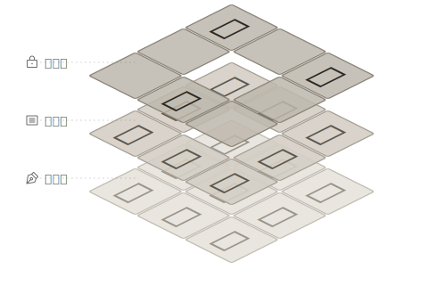

# {{NINE_BOX_VIEW}}

9칸 미리보기 도구로, 서체 디자이너가 디자인 과정에서 편집 중인 글자와 주변 참조 글자의 배열 효과를 실시간으로 미리 볼 수 있습니다.

## 목차

- [설치 방법](#설치-방법)
- [빠른 시작](#빠른-시작)
- [핵심 개념: 3층 미리보기 시스템](#핵심-개념-3층-미리보기-시스템)
- [인터페이스 개요](#인터페이스-개요)
- [9칸 위치 정의](#9칸-위치-정의)
- [기능 설명](#기능-설명)

## 설치 방법

### {{GLYPHS_PLUGIN_MANAGER}}를 통해 설치

> [!TIP]
> {{GLYPHS_PLUGIN_MANAGER}}를 통한 설치를 권장합니다. 자동 업데이트를 받을 수 있습니다.

1. Glyphs에서 **{{GLYPHS_WINDOW_MENU}} > {{GLYPHS_PLUGIN_MANAGER}}** 열기
2. "{{NINE_BOX_VIEW|}}" 검색
3. "{{GLYPHS_INSTALL}}" 클릭

### 수동 설치

1. 플러그인 파일(.glyphsPlugin) 다운로드
2. 파일을 더블 클릭하여 설치
3. Glyphs 재시작

## 빠른 시작

1. **플러그인 열기**: **{{GLYPHS_VIEW_MENU}} > {{NINE_BOX_VIEW}}** 선택
2. **참조 글자 입력**: 툴바의 {{ICON_REFERENCE}} 버튼을 클릭하여 {{REFERENCE_PANEL_TITLE|}} 열기
3. **미리보기 확인**: 9칸에 현재 편집 중인 글자(중앙)와 주변 참조 글자가 표시됨

### 30초 만에 시작하기

```
1. 9칸 창 열기
2. 참조 글자 입력: 한가나다
3. 9칸 내부를 클릭하면 참조 글자가 무작위로 배열됨
4. 글자 편집을 계속하면 배열 효과가 실시간으로 미리보기됨
```

> [!TIP]
> **Shift** 키를 누르고 있으면 Solo 모드로 들어가 참조 글자와 잠금 글자가 일시적으로 숨겨집니다.

## 핵심 개념: 3층 미리보기 시스템

{{NINE_BOX_VIEW}}는 3층 스택 디자인을 채택하여 다양한 컨텍스트에서 글자의 표현을 동시에 관찰할 수 있습니다:

<figure class="concept-figure">
  
</figure>

### 편집 글자 (최하층)

현재 편집 중인 글자로, 9칸의 모든 셀에 실시간으로 동기화되어 표시됩니다. 이것이 작업의 초점입니다.

### 참조 글자 (중간층)

무작위로 배열된 일반 글자로, 문제가 있는 조합을 빠르게 발견하는 데 도움이 됩니다. 9칸 내부를 클릭하면 셔플됩니다.

### 잠금 글자 (최상층)

지정된 위치에 고정된 글자로, 안정적인 비교 기준을 확립합니다. 설정은 파일과 함께 저장됩니다.

> [!NOTE]
> 3층은 아래에서 위로 겹쳐서 표시됩니다. 잠금 글자는 참조 글자보다 우선하며 해당 위치의 참조 글자를 덮어씁니다.

## 인터페이스 개요

### 메인 창

9칸 메인 창은 플로팅 패널로 다음을 포함합니다:

- **9칸 표시 영역**: 3×3 글자 미리보기 그리드
- **툴바**: 하단의 작업 버튼 영역
- **타이틀 바 메뉴**: 오른쪽 상단의 **{{TITLEBAR_MENU_TOOLTIP|}}** 버튼

### 툴바 버튼

| 버튼 | 기능 | 설명 |
|------|------|------|
| {{ICON_SUN}}/{{ICON_MOON}} | 테마 전환 | 라이트/다크 모드 전환 |
| 슬라이더 | 흐림 정도 | 9칸 창 전체의 흐림 정도를 조절하여 전체 회색 분포 확인 |
| {{ICON_PRESETS}} | {{PRESETS_WINDOW_TITLE|}} | 프리셋 패널 열기/닫기 |
| {{ICON_LOCK}} | {{LOCKED_PANEL_TITLE|}} | 잠금 글자 패널 열기/닫기 |
| {{ICON_REFERENCE}} | {{REFERENCE_PANEL_TITLE|}} | 참조 글자 입력 패널 열기/닫기 |
| {{ICON_MENU}} | {{TITLEBAR_MENU_TOOLTIP|}} | 정보 메뉴 열기 |

### 정보 메뉴

타이틀 바의 **{{ICON_MENU}}** 버튼을 클릭하여 열기:

| 항목 | 설명 |
|-----|------|
| {{ABOUT_MENU_ITEM|}} | {{ABOUT_WINDOW_TITLE|}} 열기 |
| {{INFO_MENU_PURCHASE|}} | 라이선스 구매 (체험 기간 중 표시) |
| {{INFO_MENU_ENTER_LICENSE|}} | 라이선스 키 입력 (체험 기간 중 표시) |
| {{INFO_MENU_HELP|}} | 사용 설명서 열기 (이 문서) |
| {{INFO_MENU_WEBSITE|}} | 공식 웹사이트로 이동 |
| {{INFO_MENU_FEEDBACK|}} | 피드백 제출 (GitHub Issues) |
| {{INFO_MENU_CONTACT_US|}} | 개발자에게 연락 (이메일) |

> [!NOTE]
> 체험 기간 중에는 메뉴에 남은 일수 상태와 구매/라이선스 입력 옵션이 추가로 표시됩니다.

### 컨텍스트 메뉴

9칸 내부에서 오른쪽 클릭하면 컨텍스트 메뉴가 열립니다:

| 항목 | 설명 |
|------|------|
| {{CONTEXT_MENU_INSERT_AT_CURSOR|}} | 9칸 내용을 Glyphs 편집 뷰의 커서 위치에 삽입 |
| {{CONTEXT_MENU_OPEN_IN_NEW_TAB|}} | 9칸 내용을 새 탭에서 열기 |
| {{CONTEXT_MENU_SHOW_TOOLBAR|}} / {{CONTEXT_MENU_HIDE_TOOLBAR|}} | 툴바 표시 전환 |
| {{CONTEXT_MENU_SHOW_REFERENCE_INPUT|}} / {{CONTEXT_MENU_HIDE_REFERENCE_INPUT|}} | {{REFERENCE_PANEL_TITLE|}} 표시 전환 |
| {{CONTEXT_MENU_SHOW_LOCKED_PANEL|}} / {{CONTEXT_MENU_HIDE_LOCKED_PANEL|}} | {{LOCKED_PANEL_TITLE|}} 표시 전환 |
| {{CONTEXT_MENU_SHOW_PRESETS|}} / {{CONTEXT_MENU_HIDE_PRESETS|}} | {{PRESETS_WINDOW_TITLE|}} 표시 전환 |
| {{CONTEXT_MENU_LIGHT_MODE|}} / {{CONTEXT_MENU_DARK_MODE|}} | 테마 모드 전환 |
| {{CONTEXT_MENU_SHOW_GRID_LINES|}} / {{CONTEXT_MENU_HIDE_GRID_LINES|}} | 그리드 선 표시 전환 |

## 9칸 위치 정의

9칸의 위치 번호는 다음과 같습니다:

```
| 6 | 7 | 8 |  ← 상단
| 3 | 4 | 5 |  ← 중앙
| 0 | 1 | 2 |  ← 하단
```

- **위치 4**: 중앙 셀, 현재 편집 중인 글자 표시, 잠금 불가
- **기타 위치**: 참조 글자 또는 잠금 글자 배치 가능

## 기능 설명

### 미리보기 레이어 기능

#### [{{REFERENCE_PANEL_TITLE|}} 기능](guide-reference)

> 참조 글자는 3층 미리보기 시스템의 "중간층"으로, 편집 글자 위에 위치합니다.

참조 글자 세트를 입력하여 9칸 주변에 표시하고, 다양한 컨텍스트에서 글자의 시각적 효과를 관찰하는 데 도움이 됩니다.

**사용 시나리오**:

- 다양한 획 밀도의 글자와의 조합 관찰
- 글자 간격과 시각적 균형 확인
- 실제 조판 상황 시뮬레이션

#### [{{PALETTE_TAB_LOCKED|}} 기능](guide-lock)

> 잠금 글자는 3층 미리보기 시스템의 "최상층"으로, 참조 글자보다 우선하여 표시됩니다.

특정 위치에 특정 글자를 고정 표시하여 안정적인 비교 기준을 확립합니다.

**사용 시나리오**:

- 표준 글자를 고정하여 디자인 참조로 사용
- 글자 페어링 비교 생성
- 디자인 일관성 추적

### 효율 도구

#### [{{PRESETS_WINDOW_TITLE|}} 기능](guide-presets)

자주 사용하는 참조 글자 조합이나 잠금 글자 설정을 저장하여 다양한 테스트 시나리오 간에 빠르게 전환할 수 있습니다.

**사용 시나리오**:

- 다양한 언어의 테스트 글자 세트 저장
- 특정 프로젝트의 참조 설정 저장
- 다양한 서체 파일 간 설정 공유

## 추가 정보

- [{{REFERENCE_PANEL_TITLE|}} 기능 상세 설명](guide-reference)
- [{{PALETTE_TAB_LOCKED|}} 기능 상세 설명](guide-lock)
- [{{PRESETS_WINDOW_TITLE|}} 기능 상세 설명](guide-presets)
- [고급 기능](guide-advanced)
- [라이선스 및 체험](guide-license)
- [자주 묻는 질문](guide-faq)
