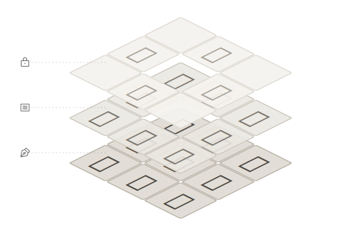

# {{NINE_BOX_VIEW}}

九宮格預覽工具，讓字型設計師在設計過程中即時預覽字符與周圍參考字的排列效果。

## 目錄

- [安裝方式](#安裝方式)
- [快速開始](#快速開始)
- [核心概念：三層預覽系統](#核心概念三層預覽系統)
- [介面總覽](#介面總覽)
- [九宮格位置定義](#九宮格位置定義)
- [功能說明](#功能說明)

## 安裝方式

### 透過 {{GLYPHS_PLUGIN_MANAGER}} 安裝

> [!TIP]
> 建議使用{{GLYPHS_PLUGIN_MANAGER}}安裝，可獲得自動更新。

1. 在 Glyphs 中開啟 **{{GLYPHS_WINDOW_MENU}} > {{GLYPHS_PLUGIN_MANAGER}}**
2. 搜尋「{{NINE_BOX_VIEW|}}」
3. 點擊「{{GLYPHS_INSTALL}}」

### 手動安裝

1. 下載外掛檔案（.glyphsPlugin）
2. 雙擊檔案進行安裝
3. 重新啟動 Glyphs

## 快速開始

1. **開啟外掛**：選擇 **{{GLYPHS_VIEW_MENU}} > {{NINE_BOX_VIEW}}**
2. **輸入參考字**：點擊工具列的 {{ICON_REFERENCE}} 按鈕開啟{{REFERENCE_PANEL_TITLE|}}
3. **查看預覽**：九宮格會顯示當前編輯字符（中央）與周圍參考字

### 30 秒上手

```
1. 開啟九宮格視窗
2. 輸入參考字：永東國酬
3. 點擊九宮格內容區，參考字會隨機排列
4. 繼續編輯字符，即時預覽排列效果
```

> [!TIP]
> 按住 **Shift** 鍵可進入 Solo 模式，暫時隱藏參考字和鎖定字。

## 核心概念：三層預覽系統

{{NINE_BOX_VIEW}} 採用三層堆疊設計，讓你同時觀察字符在不同情境下的表現：

<figure class="concept-figure">
  
</figure>

### {{ICON_PEN_NIB}} 編輯字（底層）

當前正在編輯的字符，即時同步顯示在九宮格每一格。這是你的工作焦點。

### {{ICON_ARTICLE}} 參考字（中層）

隨機排列的常用字符，幫助你快速發現問題搭配。點擊九宮格可重新洗牌。

### {{ICON_LOCK}} 鎖定字（頂層）

固定在指定位置的字符，建立穩定的比較基準。設定會隨檔案保存。

> [!NOTE]
> 三層由下往上疊加顯示。鎖定字優先於參考字，會覆蓋該位置的參考字。

### 拖曳關係

三層之間的拖曳操作有不同的限制：

| 層級 | 可接收拖曳 | 可輸出拖曳 | 說明 |
|------|-----------|-----------|------|
| {{ICON_PEN_NIB}} 編輯字 | ✗ | ✓ | 中央格只能向外輸出，無法作為拖放目標 |
| {{ICON_ARTICLE}} 參考字 | ✓（可見層） | ✓ | 可與最上層顯示的字符交換位置 |
| {{ICON_LOCK}} 鎖定字 | ✓ | ✓ | 可從編輯字或參考字層透過 ⌘ + 拖曳加入 |

> [!TIP]
> 若要將編輯中的字符固定到某個位置，使用 **⌘ + 拖曳**從中央格拖曳到目標位置即可建立鎖定字。

## 介面總覽

### 主視窗

九宮格主視窗是一個浮動面板，包含：

- **九宮格顯示區**：3×3 的字符預覽網格
- **工具列**：底部的操作按鈕區
- **標題列選單**：右上角的 **{{TITLEBAR_MENU_TOOLTIP|}}** 按鈕

### 工具列按鈕

| 按鈕 | 功能 | 說明 |
|------|------|------|
| {{ICON_SUN}}/{{ICON_MOON}} | 主題切換 | 切換淺色/深色模式 |
| 滑桿 | 模糊程度 | 調整整個九宮格視窗的模糊程度，用於檢視整體灰度分佈 |
| {{ICON_PRESETS}} | {{PRESETS_WINDOW_TITLE|}} | 開啟/關閉字組管理面板 |
| {{ICON_LOCK}} | {{LOCKED_PANEL_TITLE|}} | 開啟/關閉鎖定字面板 |
| {{ICON_REFERENCE}} | {{REFERENCE_PANEL_TITLE|}} | 開啟/關閉參考字輸入面板 |
| {{ICON_MENU}} | {{TITLEBAR_MENU_TOOLTIP|}} | 開啟資訊選單 |

### 資訊選單

點擊標題列的 **{{ICON_MENU}}** 按鈕開啟：

| 項目 | 說明 |
|-----|------|
| {{ABOUT_MENU_ITEM|}} | 開啟{{ABOUT_WINDOW_TITLE|}} |
| {{INFO_MENU_PURCHASE|}} | 購買授權（試用期間顯示） |
| {{INFO_MENU_ENTER_LICENSE|}} | 輸入授權碼（試用期間顯示） |
| {{INFO_MENU_HELP|}} | 開啟使用說明（本文件） |
| {{INFO_MENU_WEBSITE|}} | 前往官方網站 |
| {{INFO_MENU_FEEDBACK|}} | 提交意見回饋（GitHub Issues） |
| {{INFO_MENU_TESTIMONIAL|}} | 分享使用心得至社群媒體 |
| {{INFO_MENU_CONTACT_US|}} | 聯絡開發者（電子郵件） |

> [!NOTE]
> 試用期間，選單會額外顯示剩餘天數狀態以及購買/輸入授權碼選項。

### 右鍵選單

在九宮格內容區按右鍵可開啟快捷選單：

| 項目 | 說明 |
|------|------|
| {{CONTEXT_MENU_INSERT_AT_CURSOR|}} | 將九宮格內容插入到 Glyphs 編輯視圖的游標位置 |
| {{CONTEXT_MENU_OPEN_IN_NEW_TAB|}} | 將九宮格內容在新分頁中開啟 |
| {{CONTEXT_MENU_SHOW_TOOLBAR|}} / {{CONTEXT_MENU_HIDE_TOOLBAR|}} | 切換工具列顯示 |
| {{CONTEXT_MENU_SHOW_REFERENCE_INPUT|}} / {{CONTEXT_MENU_HIDE_REFERENCE_INPUT|}} | 切換{{REFERENCE_PANEL_TITLE|}}顯示 |
| {{CONTEXT_MENU_SHOW_LOCKED_PANEL|}} / {{CONTEXT_MENU_HIDE_LOCKED_PANEL|}} | 切換{{LOCKED_PANEL_TITLE|}}顯示 |
| {{CONTEXT_MENU_SHOW_PRESETS|}} / {{CONTEXT_MENU_HIDE_PRESETS|}} | 切換{{PRESETS_WINDOW_TITLE|}}顯示 |
| {{CONTEXT_MENU_LIGHT_MODE|}} / {{CONTEXT_MENU_DARK_MODE|}} | 切換主題模式 |
| {{CONTEXT_MENU_SHOW_GRID_LINES|}} / {{CONTEXT_MENU_HIDE_GRID_LINES|}} | 切換格線顯示 |

## 九宮格位置定義

九宮格的位置編號如下：

```
| 6 | 7 | 8 |  ← 頂部
| 3 | 4 | 5 |  ← 中央
| 0 | 1 | 2 |  ← 底部
```

- **位置 4**：中央格，顯示當前編輯的字符，不可鎖定
- **其他位置**：可放置參考字或鎖定字

## 功能說明

### 預覽層功能

#### [{{REFERENCE_PANEL_TITLE|}}功能](guide-reference)

> 參考字是三層預覽系統的「中層」，位於編輯字之上。

輸入一組參考字符，在九宮格周圍顯示，幫助觀察字符在不同上下文中的視覺效果。

**適用場景**：

- 觀察字符與不同筆畫密度字符的搭配
- 檢查字符間距與視覺平衡
- 模擬真實排版情境

#### [{{PALETTE_TAB_LOCKED|}}功能](guide-lock)

> 鎖定字是三層預覽系統的「頂層」，優先於參考字顯示。

將特定位置固定顯示某個字符，建立穩定的比較基準。

**適用場景**：

- 固定標準字作為設計參考
- 建立字符配對比較
- 追蹤設計一致性

### 效率工具

#### [{{PRESETS_WINDOW_TITLE|}}功能](guide-presets)

儲存常用的參考字組合或鎖定字配置，快速切換不同測試情境。

**適用場景**：

- 儲存不同語言的測試字組
- 保存特定專案的參考配置
- 在不同字型檔案間共享設定

## 更多資訊

- [{{REFERENCE_PANEL_TITLE|}}功能詳細說明](guide-reference)
- [{{PALETTE_TAB_LOCKED|}}功能詳細說明](guide-lock)
- [{{PRESETS_WINDOW_TITLE|}}功能詳細說明](guide-presets)
- [進階功能](guide-advanced)
- [授權與試用](guide-license)
- [常見問題](guide-faq)
